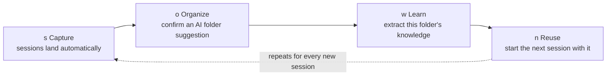
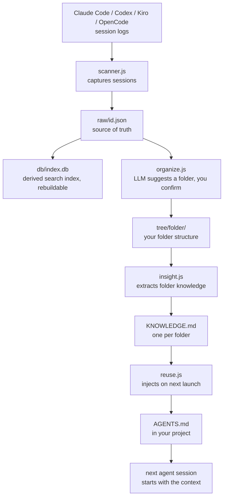

**[← Back to README](../README.md)**

# How It Works

AI sessions pile up fast and get lost once they end. Mycelium keeps the ones worth remembering and carries their knowledge into your next session.

## The loop, from your side

**`s` Capture.** Claude Code, Codex, Kiro, and OpenCode sessions are picked up on their own, every 5 minutes by default while Mycelium is open (tune with `MYCELIUM_SCAN_MS`). Nothing is filed into a folder yet. Press `s` any time to capture immediately, most often you never need to.

**`o` Organize.** Mycelium reads unfiled sessions, compares them to your existing folders, and suggests where each one belongs. You review the list and confirm. A session you filed yourself is never moved again by automation. See [Learn/Reuse loop](./learn-reuse.md) for the full rules.

**`w` Learn.** Once a folder has a few sessions, `w` compiles their summaries and decisions into that folder's `KNOWLEDGE.md`. You see a preview before it saves. This is the one step Mycelium keeps manual by design. Deciding what counts as a settled convention deserves a human look.

**`n` Reuse.** Starting a new session from Mycelium injects the folder's current knowledge into `AGENTS.md`, so the agent already knows the conventions before it writes a line. Handing work to a different agent mid-task works the same way; see [Handoff](./handoff.md).

Most of this already runs in the background. Pressing these keys is mostly reviewing and confirming what is already waiting for you. See [TUI](./tui.md) for every key, and [CLI](./cli.md) to run the same steps without the interface.

## Why it holds together

Every session normalizes into one neutral schema, so Mycelium never depends on one vendor's log format. `raw/id.json` is the only source of truth. The sqlite search index is derived from it and can be rebuilt any time with `mycelium reindex`. `KNOWLEDGE.md` is the one file every downstream step reads from, and `AGENTS.md` injection only ever touches a marked block it owns, leaving the rest of the file alone. Full design principles live in [Architecture](./architecture.md).
